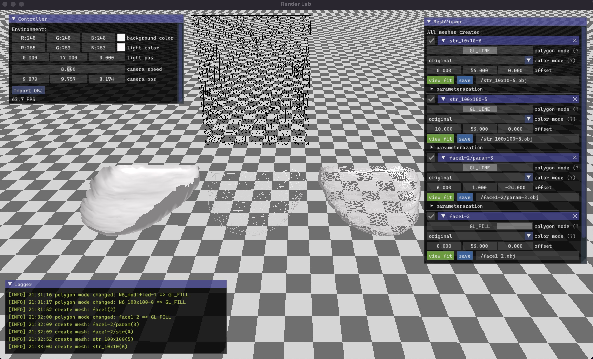

## RenderLab

This is about **Topology** and **Render**

## screenshot

### Build and run

- **Win32**: `.\build.bat && .\main.exe` **or** go [here](https://github.com/hx-w/RenderLab/actions) to download compiled Windows-x86 artifact
- **MacOS**: `sh build.sh && ./main`

### Introduction

TODO
